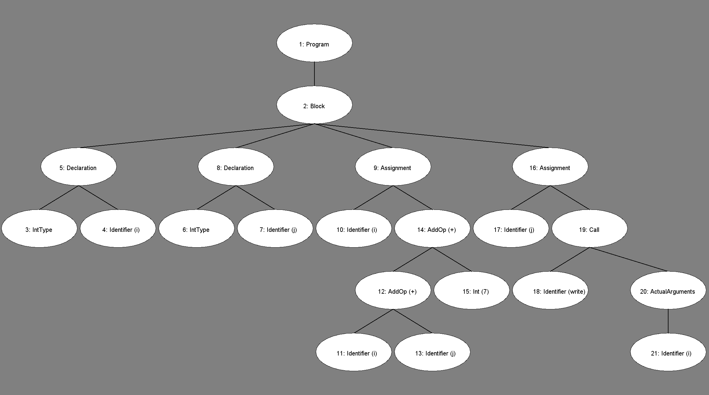

# Custom Programming Language Compiler in Java
This compiler is made for the X programming language. The compiler does lexical analysis, parsing, code generation, and finally interperetation of the bytecode. 

---
The X programming language is very simple. X files end in the .x extension. \
Below are the valid symbols
| Symbolic Constant | Lexeme | Description |
| :---: | :----: | :----:|
| Greater | > | |
| GreaterEqual | >= | |
BinaryType | binary | This is the type used to declare a binary variable
BinaryLit | \<binary> | One or more consecutive 0s and 1s, ending with a lower or upper case letter b: Valid Examples: 00001b 1010101B 1000b
CharType | char | This is the type used to declare a character variable
CharLit | \<char> | A single valid character (as determined by Java’s Character.isLetterOrDigit()), enclosed in single quotes: Valid examples: ‘a’ ‘7’
BoolAnd | and | Boolean and operator
BoolOr | or | Boolean or operator
BoolXor | xor | Boolean xor operator
Iterate | iter | Iteration over a range
Pipette | \|- | | 
Tilde | ~ | |

Example x program (xsamples/simple.x):
```
program { int i int j
   i = i + j + 7
   j = write(i)
}
```

Sample visitor tree image:


### TODO
generate bytecode files given .x file

## What I Learned
I learned the full compilation process by implementing a bytecode interpreter, and the steps that step takes. It starts with the ByteCode files generated in the parser step. We take that file and read it line by line into the ByteCodeLoader. The ByteCodeLoader takes the string, and gets the type of code it is. Using that code, along with the CodeTable, we are able to use Java's reflection to make that an instance of that bytecode. We then pass the arguments to the bytecode, and add it to the Program object. The program object holds all the bytecode in a List to be executed later in the process. That program object is then passed to the VirtualMachine, which executes the bytecodes. The VirtualMachine also holds the RuntimeStack. While the program runs, variables are loaded into the RuntimeStack. Finally, the VirtualMachine holds a counter for the program. This counter is used to keep track of where we are in the program, and is used to jump to other parts of the program when Goto or Call bytecodes are executed.

## Challenges I Encountered
The biggest encounter I had was knowing where to start. I started in order of the steps, but that only left me not knowing if what I had done was correct or not until I complete the next step. It wasnt until after the first 5 steps were complete and was then starting to work on the VirtualMachine when I started gaining more of an understanding of the process. I was able to go back and make changes to the previous steps to make sure they were correct. I tested on the program used in the first ~40 slides, the program in the pdf, and the factorial program the professor generated. This was definitely the hardest assignment I have ever done in any computer science class, but I learned a lot from it.
